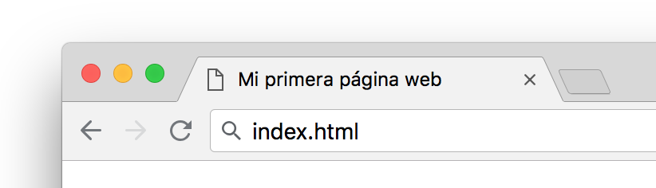
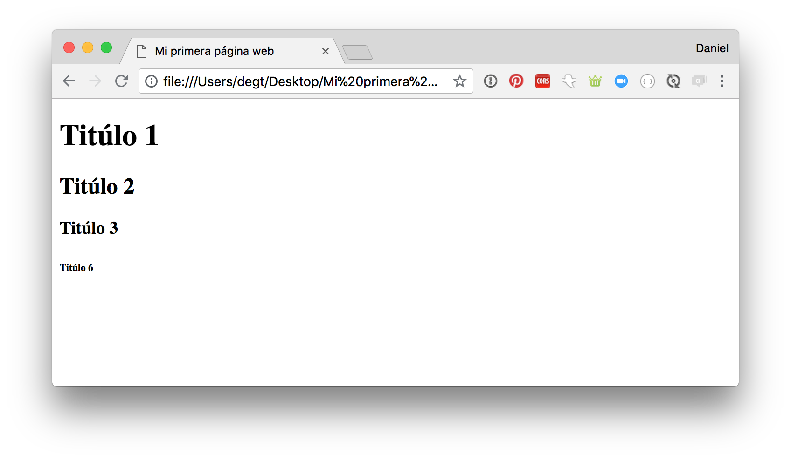
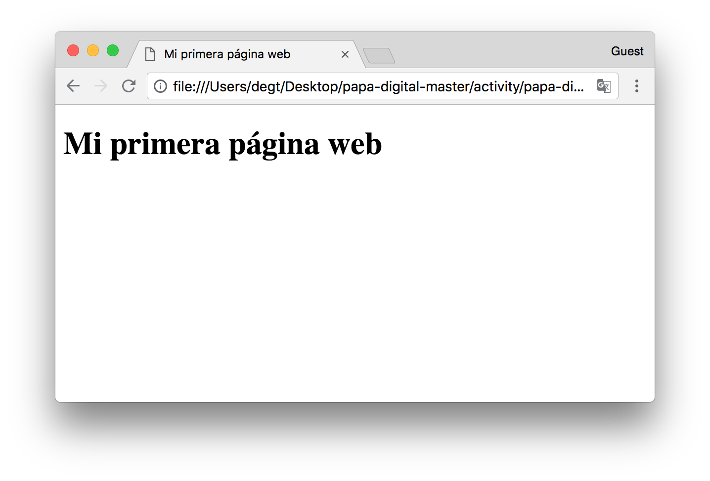
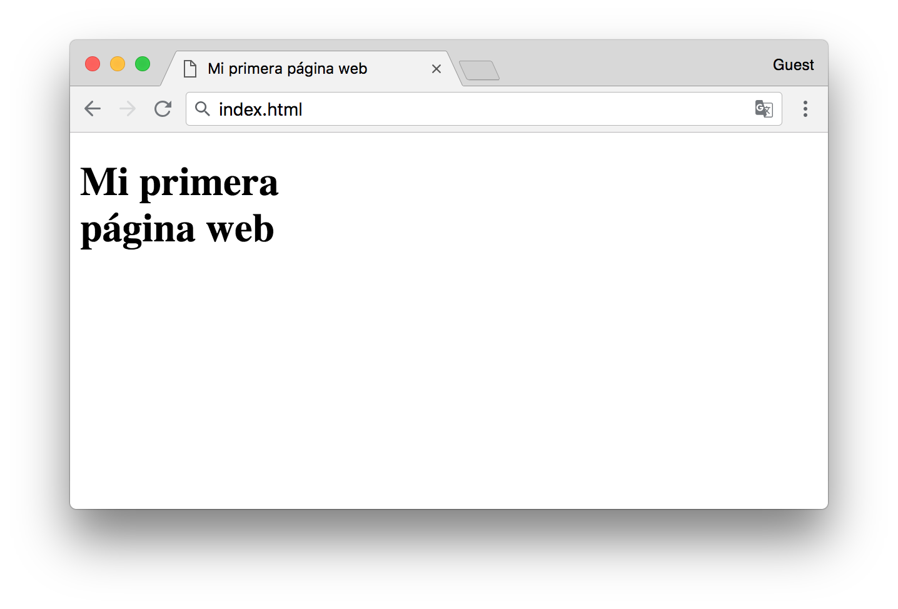
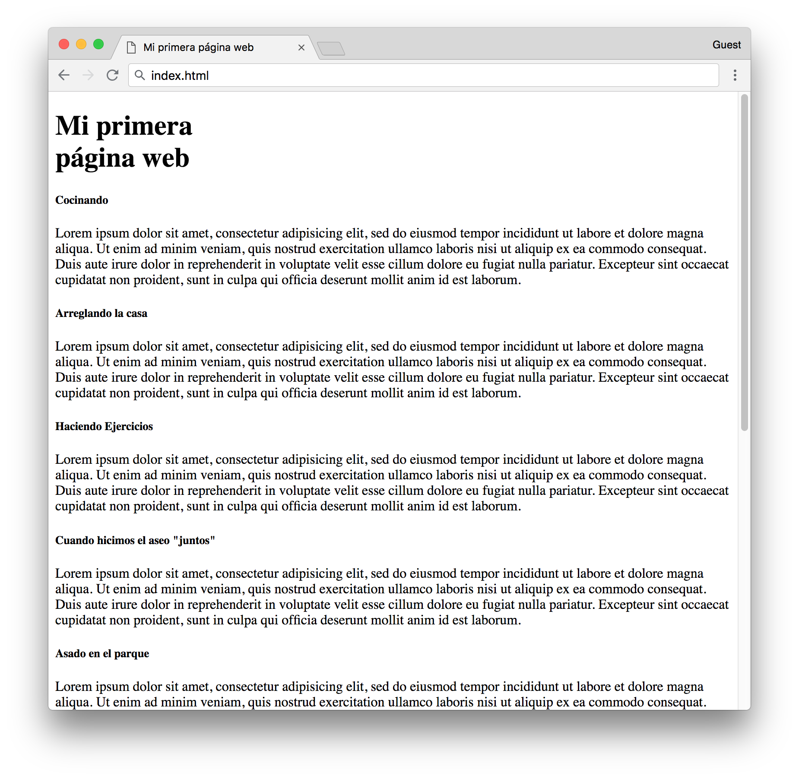
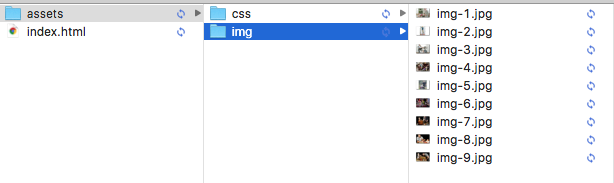
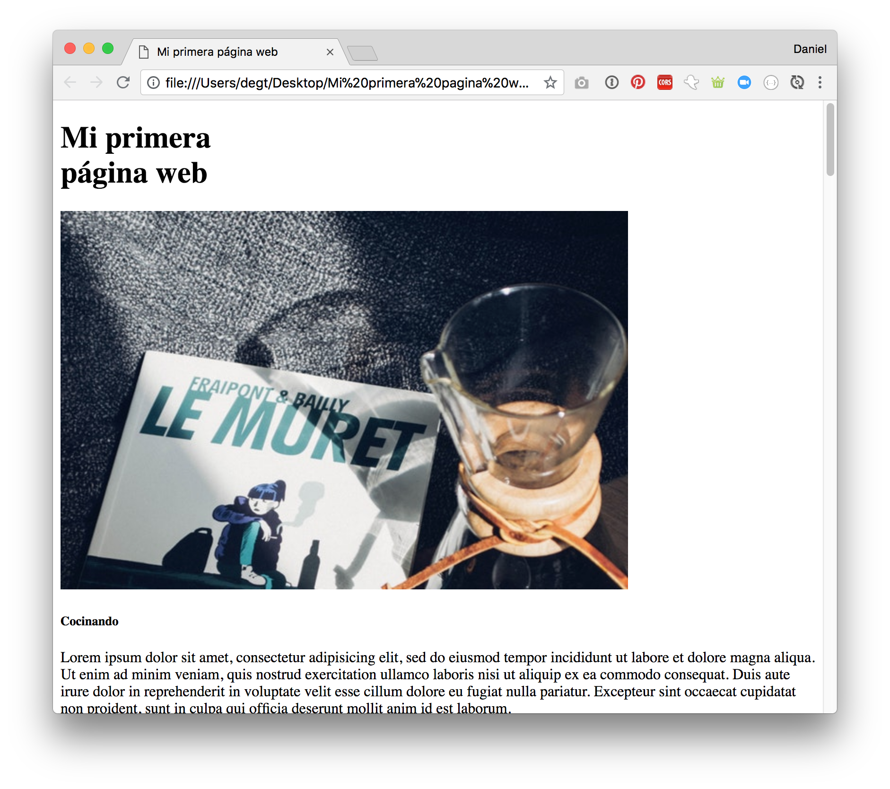
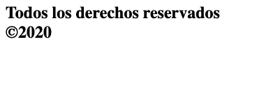

<section class="cover">

# Mamá digital en Academia Desafío


## Bienvenidos

Bienvenidos a una nueva actividad en la academia desafío, en esta oportunidad vamos a celebrar el día de la persona mas importante en nuestra vida, **mi mamá**, bueno, nuestras mamitas, abuelitas, nuestras queridas madres o matriarcas de nuestro hogar.

El objetivo, es utilizar esta tarde, para compartir una nueva experiencia, divertirnos y aprender a hacer una página web.

Todos los pasos importantes que necesitas realizar se encuentran en esta guía, la revisaremos en conjunto y  haremos  las actividades. De esta forma aprenderemos en la práctica a construir una página web simple.

Si no tienes ningún conocimiento previo, no te preocupes, te guiaremos en el proceso.

Trataremos de ir explicando cada término utilizado para que tengas un contexto de lo que estamos haciendo, y a tu disposición estarán los mentores para ayudarte cuando lo necesites. 


## ¿Qué se necesita para este taller?

Para el evento solo necesitas que tu computador tenga instalado, un navegador y un editor de texto. Y de tu parte  muchas ganas de participar y aprender.

Como navegador puedes ocupar alguno de los siguiente:

- Firefox
- Safari
- Chrome
- Opera

Como editor de texto te recomendamos:

- [Atom](https://atom.io/)

***Con el editor de texto instalado pasemos a la siguiente sección***


## ¿Qué es lo que vamos a crear?

Vamos a hacer una página web, para compartir recuerdos con todo el mundo, y mostrar los buenos momentos, que tengamos con nuestra mamá, mamita, abuelita. Nuestra Madre o familia.
La página se vera así:¿Genial no?, Antes de continuar, vamos a definir algunos conceptos para acompañar la actividad con conocimientos básicos. ¡Vamos a ello!.

## Introducción a páginas web

### ¿Qué es una página web?

Si buscamos en google, posiblemente encontremos desde respuestas muy complejas a que la respuesta esta en nuestro corazón, así que definiremos de forma muy simple algunos términos.

***WebPage (página web):*** Es un documento que puede ser visto en la pantalla a través de un navegador como Firefox, Google Chrome, Internet Explorer. Solo es un documento.

***Website (sitio Web):*** Es una colección de páginas(documentos), agrupadas y conectadas, generalmente de un mismo tema o tópico.

***Web Server (servidor Web):*** Es un computador que guarda los archivos de los sitios web.

***CSS(Cascading Stylesheets):*** Significa hojas de estilo en cascada y es un lenguaje para definir estilos a las etiquetas HTML. CSS también puede definir como los elementos pueden ser mostrados.

***JS (JavaScript):***  Es un lenguaje de programación que permite modificar dinámicamente elementos de HTML y CSS y de esta forma agregar componentes y comportamientos nuevos a la página web así como agregar diversos tipos de animaciones e interactuar con información de otros sitios web.


### Primeros pasos con una página web:

Vamos a crear un proyecto totalmente desde cero, sigue los pasos y si tienes dudas, acércate a algún mentor, estamos acá para ayudar.


#### Primer paso :

Vamos a crear una carpeta nueva en el escritorio. Le puedes llamar como tu quieras, como ejemplo **"proyecto web"**, **"La mejor mamá"**, **"recuerdos"** etc.

#### Segundo paso:

Luego abriremos la carpeta en **Atom** (tú editor de texto).

- Puede ser arrastrando la carpeta hacia el editor de texto
- O abriéndola desde el editor de texto.

#### Tercer paso:

Ahora crearemos un archivo nuevo llamado `index.html` (debemos presionar sobre la carpeta del proyecto con el botón secundario y utilizar la opción "New File").


Luego:

Llamaremos a nuestro primer archivo


```
index.html
```


Presionamos *enter* y el archivo quedó guardado como **index.html**

#### Cuarto Paso:

Ahora escribiremos, en nuestro archivo:

```html
Feliz día MAMÁ!!!
```

Luego guardamos el archivo, para hacerlo puedes ir a la opción `File / save`, pero te recomiendo que utilices el atajo del teclado.

***Ctrl + s (Windows, Linux) o  cmd + s (mac).***

#### Quinto paso

Ahora podemos abrir este archivo con nuestro navegador, para lograrlo iremos a la carpeta donde está guardado y podemos arrastrarlo con el mouse dentro del navegador, o hacerle doble click.

Al abrirlo en el navegador te debería aparecer algo como esto:


***Felicidades!!	Ya estás escribiendo tú primera página web!!!*** Aun no tiene el aspecto esperado y aparecen algunos carácteres extraños, pero vamos paso a paso.

### Recapitulemos

Fueron solo 5 pasos, Fácil ¿cierto?.

Respondamos algunas preguntas.

***¿Por qué llamar al archivo de inicio como index?***

Porque es una convención, se subentiende que es el archivo índice que inicia una página web.

***¿Por qué la extensión del archivo es .html?***

El que sea .html dice que es un archivo que se interpretará como HTML, es decir el navegador abrirá y leerá su contenido, En la siguiente sección aprenderemos mas sobre HTML.

## ¿Qué es HTML?

HTML significa "HyperText Markup Language" - en español, **Lenguaje de Marcas** de HyperTexto.

**HyperText** significa que es un tipo de texto que soporta hipervínculos entre páginas.

**Marcado** significa que hemos tomado un documento y lo marca con código para decirte cómo interpretar la página (en este caso, un navegador).

HTML es un lenguaje de **marcas**, cada una comenzando con `<` y terminando con `>`. Estas etiquetas definen **propiedades**, la **importancia** y el **significado semántico** del contenido que envuelven.


Entonces una página web es un archivo que contiene un conjunto de marcas ó etiquetas y el navegador lee (interpreta) estas marcas y con esa información  muestra las páginas web.

##  ¿Que es la Estructura HTML?

Un archivo HTML para poder ser interpretado correctamente deber tener una estructura. Esta estructura básica consiste en una **cabeza** (*head*) y un **cuerpo** (*body*), la cabeza contiene toda la información que es para el **navegador**, el cuerpo de la página contiene toda la información que es para el **usuario**. Dentro de las etiquetas HTML se encuentra todo el contenido de la página, y dentro de ellas están los dos bloques previamente mencionados.
La estructura de una página en HTML es la siguiente:

```html<!DOCTYPE html><html>
  <head>
    <title></title>
  </head>
  <body>
    <!-- Aquí va el contenido de la página web -->
  </body>
</html>
```

El `doctype` (o tipo de documento) es la primera etiqueta que leeremos y le indica al navegador como debe interpretar el resto del documento. En el ejemplo veremos que el doctype especificado es de HTML5, el cuál es el estándar de actual.

La etiqueta `<html>` especifica que desde ese punto en adelante todo lo que venga deberá ser interpretado como HTML.

En HTML la etiqueta `<head>` Contendrá información variada, desde dónde encontrar las hojas de estilo o los iconos, hasta cuál es el título del sitio o sencillamente cómo debe manejar la página en el caso de que tenga que adaptarse a distintos tamaños de pantalla.

# Creando nuestra página

## Trabajaremos en la cabeza (Head)

Primero trabajaremos ingresando información que nuestra página tiene que indicarle al navegador para poder funcionar, trabajaremos en el **head**.

### Estructura

Le asignaremos un estructura a nuestro `index.html`.
1-	En nuestro archivo `index.html`, borra el mensaje que habíamos creamos.

2-	Escribe en la primera línea ```html``` y presiona *enter*.

Gracias a las cualidades de nuestro editor de texto, al presionar **enter** luego de escribirlo, nos autocompleta la estructura base del archivo.


Ahora ya tenemos la estructura de nuestra página.


!No olvides guardar la página¡, para ello utiliza,  **Ctrl + s(Windows, Linux)**  o **cmd + s(Mac)** , Atom borrará el punto azul en el nombre de nuestro archivo cuando esta guardado.

### El título de la página

Ahora vamos a añadir un título a la página, para ello vamos a rellenar información en el **head** de nuestro archivo `index.html`.
Este título lo veremos en el navegador, posiblemente en la pestaña(tab) o barra superior.

Para hacerlo, escribe entre las marcas `<title>` y `</title>` el titulo que deseas ponerle a tu página.

En mi caso dejare el título **Día de la mamá**

```html
<!DOCTYPE html>
<html lang="es" dir="ltr">
  <head>
    <meta charset="utf-8">
    <title>Día de la madre</title>
  </head>
  <body>

  </body>
</html>
```

Si guardamos, y recargamos el navegador, el resultado será el siguiente:



>Cabe destacar que Los bookmarks ocupan el título de la página al guardarla, es decir al guardar la página en favoritos, tendrá este nombre.

>El título tiene mucho valor en el SEO(search engine optimization) de un sitio web, esto quiere decir que los títulos son importantes para posicionar una página en un buscador.


### Eliminando caracteres extraños
Como recuerdan, nuestro primer mensaje tenia caracteres extraños donde se deberían mostrar tildes o letras Ñ. Esto se arregla con la etiqueta `<meta charset="utf-8">`. Esta indica que la codificación de la página muestre estos caracteres.

También podemos ver que hay algo nuevo que no habíamos visto en otras etiquetas, en primer lugar la marca no se cierra, esto ocurre por una regla simple, si la etiqueta no tiene contenido, no se cierra, y para pasarle valores adicionales se ocupan **atributos** y **valores**, En este caso `charset` sería el *atributo* y `utf-8` el *valor*.

## Trabajando en el Body

### Etiquetas Básicas:

Una etiqueta en HTML es un elemento que define como se comporta y muestra el contenido que alberga, vamos a utilizar algunas etiquetas básicas del lenguaje para darle sentido a nuestra página.
Todo lo que veremos desde ahora se debe escribir dentro de **body** *(hasta que se indique lo contrario), por ende dentro de las etiquetas* `<body>` `</body>`

### Títulares y Subtitulares:

Una página web también tiene títulares y subtitulares, al igual que un periódico!, la marca para los titulares es `<h>` **más** un número del `1` al `6`. Siendo `<h1>` para el titular principal o con mayor importancia y `<h6>` para el subtítulo del subtítulo del subtítulo del subtítulo del subtítulo del título!.
Por ejemplo escribamos en nuestro archivo index.html:

```html
<!DOCTYPE html>
<html lang="es" dir="ltr">
  <head>
    <meta charset="utf-8">
    <title>Día de la madre</title>
  </head>
  <body>
    <h1>Titúlo 1</h1>
    <h2>Titúlo 2</h2>
    <h3>Titúlo 3</h3>
    <h6>Titúlo 6</h6>
  </body>
</html>
```

Guardemos los cambios, refrescamos el navegador y se debería ver algo como esto:


Se puede ver que el titular `<h6>` es muy pequeño, incluso menor que otros elementos que veremos a continuación.Ahora vamos a añadir el título de muestra página, Así que eliminemos los títulares que ingresamos y escribamos lo siguiente.


```html
<!DOCTYPE html>
<html lang="es" dir="ltr">
  <head>
    <meta charset="utf-8">
    <title>Día de la Mamá</title>
  </head>
  <body>
    <h1>Mis recuerdos con mamá</h1>
  </body>
</html>
```

Deberíamos ver algo como esto:




Aun estamos muy lejos de la página que queremos lograr, pero vamos avanzando.

### Quiebre de línea con `<br>`

Si observamos la página que queremos lograr, el titular principal esta en dos líneas, pareciera que son dos etiquetas, pero es solo una. Para lograr este resultado utilizaremos una etiqueta especial llamada "break line" `<br>`, agreguémosla en nuestro código.

```html
<!DOCTYPE html>
<html lang="es" dir="ltr">
  <head>
    <meta charset="utf-8">
    <title>Día de la madre</title>
  </head>
  <body>
    <h1>Mis recuerdos con <br>mamá</h1>
  </body>
</html>

```
Guardamos y recargamos la página en el navegador, deberíamos ver algo como esto:



Genial!, ahora tenemos el titular de nuestra página, solo nos falta añadirle un detalle. 

La frase antes de "mamá" lleva una tipografía mas pequeña que el resto, para mas adelante añadirle este efecto, vamos a envolverla en una etiqueta llamada "span", nuestro código debería quedar así:

```html
<!DOCTYPE html>
<html lang="es" dir="ltr">
  <head>
    <meta charset="utf-8">
    <title>Día de la madre</title>
  </head>
  <body>
    <h1><span>Mis recuerdos con </span><br>mamá</h1>
  </body>
</html>
```

Este cambio no por el momento no supondrá ningún cambio visual.

## Continuando con la página.

Para los siguientes pasos, nos fijaremos en la página de muestra. Luego de los títulos, vienen varias tarjetas con una foto, un títular y un párrafo, aprenderemos a crear estos elementos.

### Nuevos títulares

Ya sabemos crear títulares, así que manos a la obra, crearemos 9 títulares `h5` en nuestras tarjetas. El contenido queda a tu elección, yo seguiré el ejemplo de la página mostrada al comienzo. Tu **HTML** debería verse así.

```html
<!DOCTYPE html>
<html lang="es" dir="ltr">
  <head>
    <meta charset="utf-8">
    <title>Día de la madre</title>
  </head>
  <body>
    <h1><span>Mis recuerdos con </span><br>mamá</h1>

    <h5>Yo en la guata de mamá</h5>

    <h5>Paseo al jardín Botánico</h5>

    <h5>Aprendiendo a andar en moto</h5>

    <h5> La vez que me perdí</h5>

    <h5>Mi caída en bicicleta</h5>

    <h5>Comida familiar en la casa de la Abuela</h5>

    <h5>Mi primer encuentro con la chala</h5>

    <h5>Mi primera desilusión amorosa</h5>

    <h5>Cuando se acabó el colegio</h5>
  
  </body>
</html>
```

Si guardas y recargas la página, deberías ver algo similar a esto:


### Párrafos y Lorem Ipsum.

Los párrafos son otra etiqueta *HTML* muy útil para introducir texto al interior de nuestra página.

Podemos observar que en las tarjetas de nuestra página va una descripción, este texto lo ingresaremos en párrafos.
vamos a ello.

Debajo del primer titular `<h5>` escribe `p` y utiliza el tabulador. El autocompletado hará su trabajo y creara una etiqueta así:

```html
	<p>    </p>
```
Escribe dentro de estos párrafos una descripción del recuerdo mencionado en el titular. Por motivos de tiempo, solo completaremos la descripción de 3 recuerdos. Los otros parrafos, los vamos autocompletar con un texto de prueba llamado "Lorem ipsum". Atom nos facilitara la vida ya que esta integrado en su autocompletado. 

Para usarlo, dentro de un párrafo, escribe "lorem" y utiliza el tabulador, de forma automática se escribirá un texto de prueba.

```html
<h5>Yo en la guata de mamá</h5>
    <p> Lorem ipsum dolor sit amet, consectetur adipisicing elit, sed do eiusmod tempor incididunt ut labore et dolore magna aliqua. Ut enim ad minim veniam, quis nostrud exercitation ullamco laboris nisi ut aliquip ex ea commodo consequat. Duis aute irure dolor in reprehenderit in voluptate velit esse cillum dolore eu fugiat nulla pariatur. Excepteur sint occaecat cupidatat non proident, sunt in culpa qui officia deserunt mollit anim id est laborum.</p>
```

Si completas todos los párrafos, tu código y pagina deberían verse así.

```html
<!DOCTYPE html>
<html lang="es" dir="ltr">
  <head>
    <meta charset="utf-8">
    <title>Día de la madre</title>
  </head>
  <body>
    <h1><span>Mis recuerdos con </span>mamá</h1>

    <h5>Yo en la guata de mamá</h5>
    <p> Lorem ipsum dolor sit amet, consectetur adipisicing elit, sed do eiusmod tempor incididunt ut labore et dolore magna aliqua. Ut enim ad minim veniam, quis nostrud exercitation ullamco laboris nisi ut aliquip ex ea commodo consequat. Duis aute irure dolor in reprehenderit in voluptate velit esse cillum dolore eu fugiat nulla pariatur. Excepteur sint occaecat cupidatat non proident, sunt in culpa qui officia deserunt mollit anim id est laborum.</p>
    <h5>Paseo al jardín Botánico</h5>
    <p>Lorem ipsum dolor sit amet, consectetur adipisicing elit, sed do eiusmod tempor incididunt ut labore et dolore magna aliqua. Ut enim ad minim veniam, quis nostrud exercitation ullamco laboris nisi ut aliquip ex ea commodo consequat. Duis aute irure dolor in reprehenderit in voluptate velit esse cillum dolore eu fugiat nulla pariatur. Excepteur sint occaecat cupidatat non proident, sunt in culpa qui officia deserunt mollit anim id est laborum.</p>
    <h5>Aprendiendo a andar en moto</h5>
    <p>Lorem ipsum dolor sit amet, consectetur adipisicing elit, sed do eiusmod tempor incididunt ut labore et dolore magna aliqua. Ut enim ad minim veniam, quis nostrud exercitation ullamco laboris nisi ut aliquip ex ea commodo consequat. Duis aute irure dolor in reprehenderit in voluptate velit esse cillum dolore eu fugiat nulla pariatur. Excepteur sint occaecat cupidatat non proident, sunt in culpa qui officia deserunt mollit anim id est laborum.</p>
    <h5> La vez que me perdí</h5>
    <p>Lorem ipsum dolor sit amet, consectetur adipisicing elit, sed do eiusmod tempor incididunt ut labore et dolore magna aliqua. Ut enim ad minim veniam, quis nostrud exercitation ullamco laboris nisi ut aliquip ex ea commodo consequat. Duis aute irure dolor in reprehenderit in voluptate velit esse cillum dolore eu fugiat nulla pariatur. Excepteur sint occaecat cupidatat non proident, sunt in culpa qui officia deserunt mollit anim id est laborum.</p>
    <h5>Mi caida en bicicleta</h5>
    <p>Lorem ipsum dolor sit amet, consectetur adipisicing elit, sed do eiusmod tempor incididunt ut labore et dolore magna aliqua. Ut enim ad minim veniam, quis nostrud exercitation ullamco laboris nisi ut aliquip ex ea commodo consequat. Duis aute irure dolor in reprehenderit in voluptate velit esse cillum dolore eu fugiat nulla pariatur. Excepteur sint occaecat cupidatat non proident, sunt in culpa qui officia deserunt mollit anim id est laborum.</p>
    <h5>Comida familiar en la casa de la Abuela</h5>
    <p>Lorem ipsum dolor sit amet, consectetur adipisicing elit, sed do eiusmod tempor incididunt ut labore et dolore magna aliqua. Ut enim ad minim veniam, quis nostrud exercitation ullamco laboris nisi ut aliquip ex ea commodo consequat. Duis aute irure dolor in reprehenderit in voluptate velit esse cillum dolore eu fugiat nulla pariatur. Excepteur sint occaecat cupidatat non proident, sunt in culpa qui officia deserunt mollit anim id est laborum.</p>
    <h5>Mi primer encuentro con la chala</h5>
    <p>Lorem ipsum dolor sit amet, consectetur adipisicing elit, sed do eiusmod tempor incididunt ut labore et dolore magna aliqua. Ut enim ad minim veniam, quis nostrud exercitation ullamco laboris nisi ut aliquip ex ea commodo consequat. Duis aute irure dolor in reprehenderit in voluptate velit esse cillum dolore eu fugiat nulla pariatur. Excepteur sint occaecat cupidatat non proident, sunt in culpa qui officia deserunt mollit anim id est laborum.</p>
    <h5>Mi primera desilución amorosa</h5>
    <p>Lorem ipsum dolor sit amet, consectetur adipisicing elit, sed do eiusmod tempor incididunt ut labore et dolore magna aliqua. Ut enim ad minim veniam, quis nostrud exercitation ullamco laboris nisi ut aliquip ex ea commodo consequat. Duis aute irure dolor in reprehenderit in voluptate velit esse cillum dolore eu fugiat nulla pariatur. Excepteur sint occaecat cupidatat non proident, sunt in culpa qui officia deserunt mollit anim id est laborum.</p>
    <h5>Cuando se acabó el colegio</h5>
    <p>Lorem ipsum dolor sit amet, consectetur adipisicing elit, sed do eiusmod tempor incididunt ut labore et dolore magna aliqua. Ut enim ad minim veniam, quis nostrud exercitation ullamco laboris nisi ut aliquip ex ea commodo consequat. Duis aute irure dolor in reprehenderit in voluptate velit esse cillum dolore eu fugiat nulla pariatur. Excepteur sint occaecat cupidatat non proident, sunt in culpa qui officia deserunt mollit anim id est laborum.</p>
  </body>
</html>
```

Si guardamos la página y recargamos el navegador, deberíamos ver algo como esto:




### Imágenes:

Hasta el momento solo hemos utilizado texto, así que pondremos algunas imágenes. La etiqueta para agregar imágenes es

~~~html

~~~

Donde `src` es *source* , que en español es fuente, que es un **atributo** de la etiqueta de imagen. `alt` es otro **atributo** de la etiqueta `img`, que te permite describir(brevemente) la imagen en caso de que no se pueda cargar por escasez de internet, o en navegadores de solo texto.

Esta etiqueta no necesita cerrarse como lo hacen las anteriores.

Para agregar imágenes utilizando esa etiqueta puedes hacerlo de dos maneras:

-Directo de una URL de internet.
-Desde una imagen desde tu proyecto (desde tu computador).

### Imágenes desde internet:

Podremos ingresar cualquier foto que este en internet si utilizamos su URL. URL quiere decir que es una dirección que apuntara hacia ese recurso.

Puedes ir a tu red social y elegir una foto, abrirla y con el botón secundario elegir en el menú, "copiar ruta de la imagen". También, puedes buscas en Google la imagen que quieras y también seleccionar "copiar dirección de la imagen"
Con este paso, tendremos la URL de la foto.
Esa url debes copiarla y pegarla dentro de los `" "` del source de la etiqueta `img`yo ingresare esta foto de ejemplo antes de mi primer `h5`.

Mi código se debe ver así: 

```html
<!DOCTYPE html>
<html lang="es" dir="ltr">
  <head>
    <meta charset="utf-8">
    <title>Día de la madre</title>
  </head>
  <body>
    <h1><span>Mis recuerdos con </span>mamá</h1>
    
    <h5>Yo en la guata de mamá</h5>
    <p> Lorem ipsum dolor sit amet, consectetur adipisicing elit, sed do eiusmod tempor incididunt ut labore et dolore magna aliqua. Ut enim ad minim veniam, quis nostrud exercitation ullamco laboris nisi ut aliquip ex ea commodo consequat. Duis aute irure dolor in reprehenderit in voluptate velit esse cillum dolore eu fugiat nulla pariatur. Excepteur sint occaecat cupidatat non proident, sunt in culpa qui officia deserunt mollit anim id est laborum.</p>
    <h5>Paseo al jardín Botánico</h5>
    <p>Lorem ipsum dolor sit amet, consectetur adipisicing elit, sed do eiusmod tempor incididunt ut labore et dolore magna aliqua. Ut enim ad minim veniam, quis nostrud exercitation ullamco laboris nisi ut aliquip ex ea commodo consequat. Duis aute irure dolor in reprehenderit in voluptate velit esse cillum dolore eu fugiat nulla pariatur. Excepteur sint occaecat cupidatat non proident, sunt in culpa qui officia deserunt mollit anim id est laborum.</p>
    <h5>Aprendiendo a andar en moto</h5>
    <p>Lorem ipsum dolor sit amet, consectetur adipisicing elit, sed do eiusmod tempor incididunt ut labore et dolore magna aliqua. Ut enim ad minim veniam, quis nostrud exercitation ullamco laboris nisi ut aliquip ex ea commodo consequat. Duis aute irure dolor in reprehenderit in voluptate velit esse cillum dolore eu fugiat nulla pariatur. Excepteur sint occaecat cupidatat non proident, sunt in culpa qui officia deserunt mollit anim id est laborum.</p>
    <h5> La vez que me perdí</h5>
    <p>Lorem ipsum dolor sit amet, consectetur adipisicing elit, sed do eiusmod tempor incididunt ut labore et dolore magna aliqua. Ut enim ad minim veniam, quis nostrud exercitation ullamco laboris nisi ut aliquip ex ea commodo consequat. Duis aute irure dolor in reprehenderit in voluptate velit esse cillum dolore eu fugiat nulla pariatur. Excepteur sint occaecat cupidatat non proident, sunt in culpa qui officia deserunt mollit anim id est laborum.</p>
    <h5>Mi caida en bicicleta</h5>
    <p>Lorem ipsum dolor sit amet, consectetur adipisicing elit, sed do eiusmod tempor incididunt ut labore et dolore magna aliqua. Ut enim ad minim veniam, quis nostrud exercitation ullamco laboris nisi ut aliquip ex ea commodo consequat. Duis aute irure dolor in reprehenderit in voluptate velit esse cillum dolore eu fugiat nulla pariatur. Excepteur sint occaecat cupidatat non proident, sunt in culpa qui officia deserunt mollit anim id est laborum.</p>
    <h5>Comida familiar en la casa de la Abuela</h5>
    <p>Lorem ipsum dolor sit amet, consectetur adipisicing elit, sed do eiusmod tempor incididunt ut labore et dolore magna aliqua. Ut enim ad minim veniam, quis nostrud exercitation ullamco laboris nisi ut aliquip ex ea commodo consequat. Duis aute irure dolor in reprehenderit in voluptate velit esse cillum dolore eu fugiat nulla pariatur. Excepteur sint occaecat cupidatat non proident, sunt in culpa qui officia deserunt mollit anim id est laborum.</p>
    <h5>Mi primer encuentro con la chala</h5>
    <p>Lorem ipsum dolor sit amet, consectetur adipisicing elit, sed do eiusmod tempor incididunt ut labore et dolore magna aliqua. Ut enim ad minim veniam, quis nostrud exercitation ullamco laboris nisi ut aliquip ex ea commodo consequat. Duis aute irure dolor in reprehenderit in voluptate velit esse cillum dolore eu fugiat nulla pariatur. Excepteur sint occaecat cupidatat non proident, sunt in culpa qui officia deserunt mollit anim id est laborum.</p>
    <h5>Mi primera desilución amorosa</h5>
    <p>Lorem ipsum dolor sit amet, consectetur adipisicing elit, sed do eiusmod tempor incididunt ut labore et dolore magna aliqua. Ut enim ad minim veniam, quis nostrud exercitation ullamco laboris nisi ut aliquip ex ea commodo consequat. Duis aute irure dolor in reprehenderit in voluptate velit esse cillum dolore eu fugiat nulla pariatur. Excepteur sint occaecat cupidatat non proident, sunt in culpa qui officia deserunt mollit anim id est laborum.</p>
    <h5>Cuando se acabó el colegio</h5>
    <p>Lorem ipsum dolor sit amet, consectetur adipisicing elit, sed do eiusmod tempor incididunt ut labore et dolore magna aliqua. Ut enim ad minim veniam, quis nostrud exercitation ullamco laboris nisi ut aliquip ex ea commodo consequat. Duis aute irure dolor in reprehenderit in voluptate velit esse cillum dolore eu fugiat nulla pariatur. Excepteur sint occaecat cupidatat non proident, sunt in culpa qui officia deserunt mollit anim id est laborum.</p>
  </body>
</html>

```

 Guardo y recargo la página se vera así.

Quizas la imagen que añadiste tenga un tamaño muy grande, no te preocupes, esto lo arreglaremos despues.

##### Imágenes desde el computador:Tambien vamos a añadir imagenes de forma local. Primero crearemos una carpeta para organizar nuestros archivos externos.
Crea **dentro** de tu proyecto una carpeta con el nombre *Assets* y en su interior otra llamada *img*, Sera en esta carpeta donde vamos a añadir las imagenes que queramos en nuestra página.

~~~
proyecto_web
└──index.html	
assets
  └───img
      └─── ejemplo.jpg
~~~


* Las imagenes puede ser formato jpg, png, jpeg. Es importante que las imágenes estén dentro de la carpeta img, para luego poder buscarlas en esa ruta.

En mi caso, yo tengo todas las imagenes que añadire en la página, si quieren utilizar estas mismas, las pueden descargar de [Acá](https://www.dropbox.com/sh/bhrvh94llnizj6j/AACxQwwFN1uWGIr6uMdg1_Yja?dl=0).

Si descargan esta carpeta, deben añadirla en `assets/img`, su carpeta debería verse como esta imágen.




Ya con las fotos incorporadas, voy añadir las primeras, luegos ustedes ya sabran como hacer el resto. 
Mi código esta así:

```html
<!DOCTYPE html>
<html lang="es" dir="ltr">
  <head>
    <meta charset="utf-8">
    <title>Día de la madre</title>
  </head>
  <body>
    <h1><span>Mis recuerdos con </span>mamá</h1>

    
    <h5>Yo en la guata de mamá</h5>
    <p> Lorem ipsum dolor sit amet, consectetur adipisicing elit, sed do eiusmod tempor incididunt ut labore et dolore magna aliqua. Ut enim ad minim veniam, quis nostrud exercitation ullamco laboris nisi ut aliquip ex ea commodo consequat. Duis aute irure dolor in reprehenderit in voluptate velit esse cillum dolore eu fugiat nulla pariatur. Excepteur sint occaecat cupidatat non proident, sunt in culpa qui officia deserunt mollit anim id est laborum.</p>

    
    <h5>Paseo al jardín Botánico</h5>
    <p>Lorem ipsum dolor sit amet, consectetur adipisicing elit, sed do eiusmod tempor incididunt ut labore et dolore magna aliqua. Ut enim ad minim veniam, quis nostrud exercitation ullamco laboris nisi ut aliquip ex ea commodo consequat. Duis aute irure dolor in reprehenderit in voluptate velit esse cillum dolore eu fugiat nulla pariatur. Excepteur sint occaecat cupidatat non proident, sunt in culpa qui officia deserunt mollit anim id est laborum.</p>

    
    <h5>Aprendiendo a andar en moto</h5>
    <p>Lorem ipsum dolor sit amet, consectetur adipisicing elit, sed do eiusmod tempor incididunt ut labore et dolore magna aliqua. Ut enim ad minim veniam, quis nostrud exercitation ullamco laboris nisi ut aliquip ex ea commodo consequat. Duis aute irure dolor in reprehenderit in voluptate velit esse cillum dolore eu fugiat nulla pariatur. Excepteur sint occaecat cupidatat non proident, sunt in culpa qui officia deserunt mollit anim id est laborum.</p>

    
    <h5> La vez que me perdí</h5>
    <p>Lorem ipsum dolor sit amet, consectetur adipisicing elit, sed do eiusmod tempor incididunt ut labore et dolore magna aliqua. Ut enim ad minim veniam, quis nostrud exercitation ullamco laboris nisi ut aliquip ex ea commodo consequat. Duis aute irure dolor in reprehenderit in voluptate velit esse cillum dolore eu fugiat nulla pariatur. Excepteur sint occaecat cupidatat non proident, sunt in culpa qui officia deserunt mollit anim id est laborum.</p>

    <h5>Mi caida en bicicleta</h5>
    <p>Lorem ipsum dolor sit amet, consectetur adipisicing elit, sed do eiusmod tempor incididunt ut labore et dolore magna aliqua. Ut enim ad minim veniam, quis nostrud exercitation ullamco laboris nisi ut aliquip ex ea commodo consequat. Duis aute irure dolor in reprehenderit in voluptate velit esse cillum dolore eu fugiat nulla pariatur. Excepteur sint occaecat cupidatat non proident, sunt in culpa qui officia deserunt mollit anim id est laborum.</p>

    <h5>Comida familiar en la casa de la Abuela</h5>
    <p>Lorem ipsum dolor sit amet, consectetur adipisicing elit, sed do eiusmod tempor incididunt ut labore et dolore magna aliqua. Ut enim ad minim veniam, quis nostrud exercitation ullamco laboris nisi ut aliquip ex ea commodo consequat. Duis aute irure dolor in reprehenderit in voluptate velit esse cillum dolore eu fugiat nulla pariatur. Excepteur sint occaecat cupidatat non proident, sunt in culpa qui officia deserunt mollit anim id est laborum.</p>

    <h5>Mi primer encuentro con la chala</h5>
    <p>Lorem ipsum dolor sit amet, consectetur adipisicing elit, sed do eiusmod tempor incididunt ut labore et dolore magna aliqua. Ut enim ad minim veniam, quis nostrud exercitation ullamco laboris nisi ut aliquip ex ea commodo consequat. Duis aute irure dolor in reprehenderit in voluptate velit esse cillum dolore eu fugiat nulla pariatur. Excepteur sint occaecat cupidatat non proident, sunt in culpa qui officia deserunt mollit anim id est laborum.</p>

    <h5>Mi primera desilución amorosa</h5>
    <p>Lorem ipsum dolor sit amet, consectetur adipisicing elit, sed do eiusmod tempor incididunt ut labore et dolore magna aliqua. Ut enim ad minim veniam, quis nostrud exercitation ullamco laboris nisi ut aliquip ex ea commodo consequat. Duis aute irure dolor in reprehenderit in voluptate velit esse cillum dolore eu fugiat nulla pariatur. Excepteur sint occaecat cupidatat non proident, sunt in culpa qui officia deserunt mollit anim id est laborum.</p>

    <h5>Cuando se acabó el colegio</h5>
    <p>Lorem ipsum dolor sit amet, consectetur adipisicing elit, sed do eiusmod tempor incididunt ut labore et dolore magna aliqua. Ut enim ad minim veniam, quis nostrud exercitation ullamco laboris nisi ut aliquip ex ea commodo consequat. Duis aute irure dolor in reprehenderit in voluptate velit esse cillum dolore eu fugiat nulla pariatur. Excepteur sint occaecat cupidatat non proident, sunt in culpa qui officia deserunt mollit anim id est laborum.</p>

  </body>
</html>
```
y guardando y recargando la página esta así:



En este ejemplo yo añadi a las imagenes a la carpeta */assets/images/*.
Entonces para agregarla en mi web se copia la ruta de donde se encuentra mi imagen en el `src` de la siguiente manera:

~~~html

~~~

Ahora te toca a ti poner una imagen sobre cada uno de los titulares `h5`.
> Si necesitas ayuda, no dudes en preguntar a los mentores.***

## Recapitulemos

Hagamos un pequeño resumen de lo que hemos aprendido:Si todo salió bien, Nuestro código debería verse así.

```html
<!DOCTYPE html>
<html lang="es" dir="ltr">
  <head>
    <meta charset="utf-8">
    <title>Día de la madre</title>
  </head>
  <body>
    <h1><span>Mis recuerdos con </span>mamá</h1>

    
    <h5>Yo en la guata de mamá</h5>
    <p> Lorem ipsum dolor sit amet, consectetur adipisicing elit, sed do eiusmod tempor incididunt ut labore et dolore magna aliqua. Ut enim ad minim veniam, quis nostrud exercitation ullamco laboris nisi ut aliquip ex ea commodo consequat. Duis aute irure dolor in reprehenderit in voluptate velit esse cillum dolore eu fugiat nulla pariatur. Excepteur sint occaecat cupidatat non proident, sunt in culpa qui officia deserunt mollit anim id est laborum.</p>

    
    <h5>Paseo al jardín Botánico</h5>
    <p>Lorem ipsum dolor sit amet, consectetur adipisicing elit, sed do eiusmod tempor incididunt ut labore et dolore magna aliqua. Ut enim ad minim veniam, quis nostrud exercitation ullamco laboris nisi ut aliquip ex ea commodo consequat. Duis aute irure dolor in reprehenderit in voluptate velit esse cillum dolore eu fugiat nulla pariatur. Excepteur sint occaecat cupidatat non proident, sunt in culpa qui officia deserunt mollit anim id est laborum.</p>

    
    <h5>Aprendiendo a andar en moto</h5>
    <p>Lorem ipsum dolor sit amet, consectetur adipisicing elit, sed do eiusmod tempor incididunt ut labore et dolore magna aliqua. Ut enim ad minim veniam, quis nostrud exercitation ullamco laboris nisi ut aliquip ex ea commodo consequat. Duis aute irure dolor in reprehenderit in voluptate velit esse cillum dolore eu fugiat nulla pariatur. Excepteur sint occaecat cupidatat non proident, sunt in culpa qui officia deserunt mollit anim id est laborum.</p>

    
    <h5> La vez que me perdí</h5>
    <p>Lorem ipsum dolor sit amet, consectetur adipisicing elit, sed do eiusmod tempor incididunt ut labore et dolore magna aliqua. Ut enim ad minim veniam, quis nostrud exercitation ullamco laboris nisi ut aliquip ex ea commodo consequat. Duis aute irure dolor in reprehenderit in voluptate velit esse cillum dolore eu fugiat nulla pariatur. Excepteur sint occaecat cupidatat non proident, sunt in culpa qui officia deserunt mollit anim id est laborum.</p>

    
    <h5>Mi caida en bicicleta</h5>
    <p>Lorem ipsum dolor sit amet, consectetur adipisicing elit, sed do eiusmod tempor incididunt ut labore et dolore magna aliqua. Ut enim ad minim veniam, quis nostrud exercitation ullamco laboris nisi ut aliquip ex ea commodo consequat. Duis aute irure dolor in reprehenderit in voluptate velit esse cillum dolore eu fugiat nulla pariatur. Excepteur sint occaecat cupidatat non proident, sunt in culpa qui officia deserunt mollit anim id est laborum.</p>

    
    <h5>Comida familiar en la casa de la Abuela</h5>
    <p>Lorem ipsum dolor sit amet, consectetur adipisicing elit, sed do eiusmod tempor incididunt ut labore et dolore magna aliqua. Ut enim ad minim veniam, quis nostrud exercitation ullamco laboris nisi ut aliquip ex ea commodo consequat. Duis aute irure dolor in reprehenderit in voluptate velit esse cillum dolore eu fugiat nulla pariatur. Excepteur sint occaecat cupidatat non proident, sunt in culpa qui officia deserunt mollit anim id est laborum.</p>

    
    <h5>Mi primer encuentro con la chala</h5>
    <p>Lorem ipsum dolor sit amet, consectetur adipisicing elit, sed do eiusmod tempor incididunt ut labore et dolore magna aliqua. Ut enim ad minim veniam, quis nostrud exercitation ullamco laboris nisi ut aliquip ex ea commodo consequat. Duis aute irure dolor in reprehenderit in voluptate velit esse cillum dolore eu fugiat nulla pariatur. Excepteur sint occaecat cupidatat non proident, sunt in culpa qui officia deserunt mollit anim id est laborum.</p>

    
    <h5>Mi primera desilución amorosa</h5>
    <p>Lorem ipsum dolor sit amet, consectetur adipisicing elit, sed do eiusmod tempor incididunt ut labore et dolore magna aliqua. Ut enim ad minim veniam, quis nostrud exercitation ullamco laboris nisi ut aliquip ex ea commodo consequat. Duis aute irure dolor in reprehenderit in voluptate velit esse cillum dolore eu fugiat nulla pariatur. Excepteur sint occaecat cupidatat non proident, sunt in culpa qui officia deserunt mollit anim id est laborum.</p>

    
    <h5>Cuando se acabó el colegio</h5>
    <p>Lorem ipsum dolor sit amet, consectetur adipisicing elit, sed do eiusmod tempor incididunt ut labore et dolore magna aliqua. Ut enim ad minim veniam, quis nostrud exercitation ullamco laboris nisi ut aliquip ex ea commodo consequat. Duis aute irure dolor in reprehenderit in voluptate velit esse cillum dolore eu fugiat nulla pariatur. Excepteur sint occaecat cupidatat non proident, sunt in culpa qui officia deserunt mollit anim id est laborum.</p>

  </body>
</html>
```

Esto se vería así:

*¡Hemos hecho todos estos pasos!*


- Aprendimos a poner titulo a la página
- Luego aprendimos a poner titulares y subtitulares.
- Añadimos párrafos.
- Aprendimos a poner imágenes de internet o locales.

***Revisa si tienes algo parecido a esto,   Felicidades¡ haz avanzado mucho , recuerda que si tienes dudas pide ayuda a los mentores.***


## Ordenando nuestra página con `header` `div`,`main` y `footer`

Tal como nuestra mamá nos dice siempre que ordenemos nuestra pieza, también deben estarlo nuestras páginas.
Actualmente nuestro contenido esta dentro de la etiqueta `body` y no se distinguen las distintas secciones.

Ahora conoceremos las etiquetas que nos ayudaran a segmentar  y ordenar la pieza, bueno no tanto, solo el código de la página.

### Header

La etiqueta `<header>` la utilizaremos para agrupar los elementos de la página que van en la parte superior de esta.

En nuestro caso será nuestro titular principal.

Vamos a ello, escribe header y utiliza el tabulador para que se autocomplete la etiqueta sobre el `h1` inicial.

Ahora corta ese h1 y pégalo dentro de la etiqueta header.

Como en este ejemplo:


### main

La etiqueta main nos indicara el contenido principal de nuestra página, en nuestro caso serán las tarjetas que contendrán las fotos y nuestros recuerdos.

Lo haremos igual que con la etiqueta anterior, solo que esta vez agruparemos todo el resto del código.

Como en este ejemplo:


### Footer

Si observamos la página de ejemplo nos daremos cuenta que tenemos un lindo mensaje en la parte inferior de la página, todo esto estará al interior de una etiqueta llamada `footer` la cual agrupara el código que vamos a incluir.

Escribe lo siguiente en tu pagina web. abajo del cierre de la etiqueta `main`, ´footer´ y enter o tab para autocompletar.

Luego, al interior de footer incluye lo siguiente 

```html
<footer>
  <h2><span>Te quiero</span><br>mamá</h2>
</footer>
```
Guarda y recarga la página, el final de tu pagina debería verse así.




### Divs:

Los divs son etiquetas que permiten anidar a otras etiqueta y nos permitirán darle un  estilo propio a la agrupación (esto lo haremos más adelante con CSS).
Envuelve varias etiquetas, y todas las etiquetas envueltas por él, están bajo la influencia del div.
vamos a añadir muchos divs en nuestra página, mucha atención:
Primero tendremos un gran div que agrupara todos los elementos de `main`. Fíjate en el siguiente ejemplo:


**Por defecto al autocompletar un `div` aparece la etiqueta `class=""`, por el momento la dejaremos vacía. Recuerda pedir ayuda a los mentores si tienes dudas.**

Cada div puede indicar una clase especifica, esto servirá mas adelante para identificar el contenido de ese div y aplicarle estilo con CSS.

Ya tenemos un gran `div`, ahora vamos añadir otros para segmentar nuestro código.

El siguiente `div`, va agrupar de a tres las tarjetas de fotos.


El ejemplo añade solo tres fotos, ahora vamos añadir los otros divs para agrupar.

si todo salio bien tu código el la sección `main` debería verse así:

```html
    <main>
      <div class="">
        <div class="">
          
          <h5>Yo en la guata de mamá</h5>
          <p> Lorem ipsum dolor sit amet, consectetur adipisicing elit, sed do eiusmod tempor incididunt ut labore et dolore magna aliqua. Ut enim ad minim veniam, quis nostrud exercitation ullamco laboris nisi ut aliquip ex ea commodo consequat. Duis aute irure dolor in reprehenderit in voluptate velit esse cillum dolore eu fugiat nulla pariatur. Excepteur sint occaecat cupidatat non proident, sunt in culpa qui officia deserunt mollit anim id est laborum.</p>

          
          <h5>Paseo al jardín Botánico</h5>
          <p>Lorem ipsum dolor sit amet, consectetur adipisicing elit, sed do eiusmod tempor incididunt ut labore et dolore magna aliqua. Ut enim ad minim veniam, quis nostrud exercitation ullamco laboris nisi ut aliquip ex ea commodo consequat. Duis aute irure dolor in reprehenderit in voluptate velit esse cillum dolore eu fugiat nulla pariatur. Excepteur sint occaecat cupidatat non proident, sunt in culpa qui officia deserunt mollit anim id est laborum.</p>

          
          <h5>Aprendiendo a andar en moto</h5>
          <p>Lorem ipsum dolor sit amet, consectetur adipisicing elit, sed do eiusmod tempor incididunt ut labore et dolore magna aliqua. Ut enim ad minim veniam, quis nostrud exercitation ullamco laboris nisi ut aliquip ex ea commodo consequat. Duis aute irure dolor in reprehenderit in voluptate velit esse cillum dolore eu fugiat nulla pariatur. Excepteur sint occaecat cupidatat non proident, sunt in culpa qui officia deserunt mollit anim id est laborum.</p>
        </div>
        <div class="">
          
          <h5> La vez que me perdí</h5>
          <p>Lorem ipsum dolor sit amet, consectetur adipisicing elit, sed do eiusmod tempor incididunt ut labore et dolore magna aliqua. Ut enim ad minim veniam, quis nostrud exercitation ullamco laboris nisi ut aliquip ex ea commodo consequat. Duis aute irure dolor in reprehenderit in voluptate velit esse cillum dolore eu fugiat nulla pariatur. Excepteur sint occaecat cupidatat non proident, sunt in culpa qui officia deserunt mollit anim id est laborum.</p>

          
          <h5>Mi caida en bicicleta</h5>
          <p>Lorem ipsum dolor sit amet, consectetur adipisicing elit, sed do eiusmod tempor incididunt ut labore et dolore magna aliqua. Ut enim ad minim veniam, quis nostrud exercitation ullamco laboris nisi ut aliquip ex ea commodo consequat. Duis aute irure dolor in reprehenderit in voluptate velit esse cillum dolore eu fugiat nulla pariatur. Excepteur sint occaecat cupidatat non proident, sunt in culpa qui officia deserunt mollit anim id est laborum.</p>

          
          <h5>Comida familiar en la casa de la Abuela</h5>
          <p>Lorem ipsum dolor sit amet, consectetur adipisicing elit, sed do eiusmod tempor incididunt ut labore et dolore magna aliqua. Ut enim ad minim veniam, quis nostrud exercitation ullamco laboris nisi ut aliquip ex ea commodo consequat. Duis aute irure dolor in reprehenderit in voluptate velit esse cillum dolore eu fugiat nulla pariatur. Excepteur sint occaecat cupidatat non proident, sunt in culpa qui officia deserunt mollit anim id est laborum.</p>  
        </div>

        <div class="">
          
          <h5>Mi primer encuentro con la chala</h5>
          <p>Lorem ipsum dolor sit amet, consectetur adipisicing elit, sed do eiusmod tempor incididunt ut labore et dolore magna aliqua. Ut enim ad minim veniam, quis nostrud exercitation ullamco laboris nisi ut aliquip ex ea commodo consequat. Duis aute irure dolor in reprehenderit in voluptate velit esse cillum dolore eu fugiat nulla pariatur. Excepteur sint occaecat cupidatat non proident, sunt in culpa qui officia deserunt mollit anim id est laborum.</p>

          
          <h5>Mi primera desilución amorosa</h5>
          <p>Lorem ipsum dolor sit amet, consectetur adipisicing elit, sed do eiusmod tempor incididunt ut labore et dolore magna aliqua. Ut enim ad minim veniam, quis nostrud exercitation ullamco laboris nisi ut aliquip ex ea commodo consequat. Duis aute irure dolor in reprehenderit in voluptate velit esse cillum dolore eu fugiat nulla pariatur. Excepteur sint occaecat cupidatat non proident, sunt in culpa qui officia deserunt mollit anim id est laborum.</p>

          
          <h5>Cuando se acabó el colegio</h5>
          <p>Lorem ipsum dolor sit amet, consectetur adipisicing elit, sed do eiusmod tempor incididunt ut labore et dolore magna aliqua. Ut enim ad minim veniam, quis nostrud exercitation ullamco laboris nisi ut aliquip ex ea commodo consequat. Duis aute irure dolor in reprehenderit in voluptate velit esse cillum dolore eu fugiat nulla pariatur. Excepteur sint occaecat cupidatat non proident, sunt in culpa qui officia deserunt mollit anim id est laborum.</p>  
        </div>        
      </div>

```
Ahora vamos añadir los `divs` que estarán dentro de las tarjetas. 

El primero agrupara los elementos de cada tarjeta, y luego crearemos para separar los textos de la imagen.

Haslo como en este ejemplo:


Solo hicimos la primera tarjeta, realiza el mismo proceso para el resto. Al finalizar tu código debería verse así.

```html
  <main>
      <div class="">
        <div class="">
          <div class="">
            
            <div class="">
              <h5>Yo en la guata de mamá</h5>
              <p> Lorem ipsum dolor sit amet, consectetur adipisicing elit, sed do eiusmod tempor incididunt ut labore et dolore magna aliqua. Ut enim ad minim veniam, quis nostrud exercitation ullamco laboris nisi ut aliquip ex ea commodo consequat. Duis aute irure dolor in reprehenderit in voluptate velit esse cillum dolore eu fugiat nulla pariatur. Excepteur sint occaecat cupidatat non proident, sunt in culpa qui officia deserunt mollit anim id est laborum.</p>
            </div>
          </div>
          <div class="">
            
            <div class="">
              <h5>Paseo al jardín Botánico</h5>
              <p>Lorem ipsum dolor sit amet, consectetur adipisicing elit, sed do eiusmod tempor incididunt ut labore et dolore magna aliqua. Ut enim ad minim veniam, quis nostrud exercitation ullamco laboris nisi ut aliquip ex ea commodo consequat. Duis aute irure dolor in reprehenderit in voluptate velit esse cillum dolore eu fugiat nulla pariatur. Excepteur sint occaecat cupidatat non proident, sunt in culpa qui officia deserunt mollit anim id est laborum.</p>
            </div>
          </div>
          <div class="">
            
            <div class="">
              <h5>Aprendiendo a andar en moto</h5>
              <p>Lorem ipsum dolor sit amet, consectetur adipisicing elit, sed do eiusmod tempor incididunt ut labore et dolore magna aliqua. Ut enim ad minim veniam, quis nostrud exercitation ullamco laboris nisi ut aliquip ex ea commodo consequat. Duis aute irure dolor in reprehenderit in voluptate velit esse cillum dolore eu fugiat nulla pariatur. Excepteur sint occaecat cupidatat non proident, sunt in culpa qui officia deserunt mollit anim id est laborum.</p>
            </div>
          </div>
        </div>

        <div class="">
          <div class="">
              
            <div class="">
              <h5> La vez que me perdí</h5>
              <p>Lorem ipsum dolor sit amet, consectetur adipisicing elit, sed do eiusmod tempor incididunt ut labore et dolore magna aliqua. Ut enim ad minim veniam, quis nostrud exercitation ullamco laboris nisi ut aliquip ex ea commodo consequat. Duis aute irure dolor in reprehenderit in voluptate velit esse cillum dolore eu fugiat nulla pariatur. Excepteur sint occaecat cupidatat non proident, sunt in culpa qui officia deserunt mollit anim id est laborum.</p>
            </div>
          </div>
          <div class="">
              
            <div class="">
              <h5>Mi caida en bicicleta</h5>
              <p>Lorem ipsum dolor sit amet, consectetur adipisicing elit, sed do eiusmod tempor incididunt ut labore et dolore magna aliqua. Ut enim ad minim veniam, quis nostrud exercitation ullamco laboris nisi ut aliquip ex ea commodo consequat. Duis aute irure dolor in reprehenderit in voluptate velit esse cillum dolore eu fugiat nulla pariatur. Excepteur sint occaecat cupidatat non proident, sunt in culpa qui officia deserunt mollit anim id est laborum.</p>
            </div>
          </div>
          <div class="">
              
            <div class="">
              <h5>Comida familiar en la casa de la Abuela</h5>
              <p>Lorem ipsum dolor sit amet, consectetur adipisicing elit, sed do eiusmod tempor incididunt ut labore et dolore magna aliqua. Ut enim ad minim veniam, quis nostrud exercitation ullamco laboris nisi ut aliquip ex ea commodo consequat. Duis aute irure dolor in reprehenderit in voluptate velit esse cillum dolore eu fugiat nulla pariatur. Excepteur sint occaecat cupidatat non proident, sunt in culpa qui officia deserunt mollit anim id est laborum.</p>
            </div>
          </div>
        </div>

        <div class="">
          <div class="">
              
            <div class="">
              <h5>Mi primer encuentro con la chala</h5>
              <p>Lorem ipsum dolor sit amet, consectetur adipisicing elit, sed do eiusmod tempor incididunt ut labore et dolore magna aliqua. Ut enim ad minim veniam, quis nostrud exercitation ullamco laboris nisi ut aliquip ex ea commodo consequat. Duis aute irure dolor in reprehenderit in voluptate velit esse cillum dolore eu fugiat nulla pariatur. Excepteur sint occaecat cupidatat non proident, sunt in culpa qui officia deserunt mollit anim id est laborum.</p>
            </div>

          </div>
          <div class="">
              
            <div class="">
              <h5>Mi primera desilución amorosa</h5>
              <p>Lorem ipsum dolor sit amet, consectetur adipisicing elit, sed do eiusmod tempor incididunt ut labore et dolore magna aliqua. Ut enim ad minim veniam, quis nostrud exercitation ullamco laboris nisi ut aliquip ex ea commodo consequat. Duis aute irure dolor in reprehenderit in voluptate velit esse cillum dolore eu fugiat nulla pariatur. Excepteur sint occaecat cupidatat non proident, sunt in culpa qui officia deserunt mollit anim id est laborum.</p>
            </div>
          </div>
          <div class="">
              
            <div class="">
              <h5>Cuando se acabó el colegio</h5>
              <p>Lorem ipsum dolor sit amet, consectetur adipisicing elit, sed do eiusmod tempor incididunt ut labore et dolore magna aliqua. Ut enim ad minim veniam, quis nostrud exercitation ullamco laboris nisi ut aliquip ex ea commodo consequat. Duis aute irure dolor in reprehenderit in voluptate velit esse cillum dolore eu fugiat nulla pariatur. Excepteur sint occaecat cupidatat non proident, sunt in culpa qui officia deserunt mollit anim id est laborum.</p>
            </div>
          </div>
        </div>
      </div>
    </main>

```

**Genial, ya tenemos la estructura HTML de nuestra página solo nos queda darle vida y alegria como lo hizo nuestra mamá.**


# Capítulo 2 Darle cariño a la página

Ahora vamos a saltar al diseño de nuestra página web. Porque un HTML no es nadie sin su CSS.


Hemos aprendido algunas cosas esenciales de HTML, lo  que vendría siendo el esqueleto de nuestro sitio web, ahora le añadiremos la "piel", el diseño, y eso lo hacemos con CSS.


# ¿Qué es CSS?

CSS es acrónimo de Cascading Style Sheet, o sea hojas de estilo que se pueden incorporar dentro de HTML para darle forma y color a nuestra voluntad.

Hay tres formas de incorporar CSS dentro de una página web.

- La primera es con un conjunto de atributos y valores dentro de la etiqueta del mismo HTML.

- La segunda consiste en agregar el CSS dentro del head del mismo documento HTML.
- La tercera forma consiste en utilizar un archivo externo. 

La **forma recomendada de trabajar es la 3º**, pero para explicar como funciona CSS ejemplificaremos sobre la primera y se dará una breve explicación de la segunda.

## Sintaxis y primera forma

Todas las instrucciones en CSS se escriben en pares propiedad: valor, para agregar CSS sobre una etiqueta HTML (Primera forma) debes agregar a la etiqueta syle="propiedad: valor"

## Un ejemplo: color para un párrafo

~~~html
<p style="color: red"> </p>
~~~

## Agregando CSS en el head

La segunda forma de agregar CSS consiste en agregar las propiedades y valores de CSS dentro de una etiqueta style en el head de la página

~~~html
<head>
  <style>
    p {
    	color: red
   	}
  </style>
</head>
~~~


### Sintaxis:
La sintaxis de CSS tiene la siguiente estructura:

~~~css
etiqueta {
	propiedad: valor;
}
~~~

# Cargando un CSS externo:

La tercera forma para incluir CSS en una página web consiste en agregar un link a un CSS externo, con externo se refiere a fuera de la página (en nuestro caso "index.html"), pero puede estar dentro del mismo servidor, o se puede cargar desde otro sitio.
Primero creamos un archivo nuevo llamado `style.css`, este archivo contendra nuestro estilos.

Primero crearemos una carpeta llamada `css` al interior de `assets`.
~~~
	proyecto_web
	└───index.html	  
		└───assets
		   └───img
		   └───css	
			   └───style.css
~~~

Luego crearemos con **ATOM**  este nuevo archivo, botón derecho sobre la nueva carpeta creada y seleccionaremos `new file` con el nombre `style.css`
El nombre no importa, lo importante es que sea `.css` para que sepa que estamos escribiendo CSS. Para decirle a nuestra página que este será el archivo que utilizaremos debemos ocupar la etiqueta *link* dentro del `<head>`.

Escribiremos lo siguiente.

```html
<link rel="stylesheet" type="text/css" href="assets/css/style.css">
```

>En Atom si se escribe link y luego se autocompleta con `tab`, la línea para agregar un CSS externo se escribe sola. Quedando nuestro head de la siguiente manera:

~~~html
<!DOCTYPE html><html><head>
    <meta charset="utf-8">
    <title>Día de la madre</title>
    <link rel="stylesheet" href="assets/css/style.css">
  </head>
<body>
.
.
.
</body>
</html>
~~~

Con esto estamos agregando el CSS del archivo style.css a nuestra página web.


#### Color:

Vamos a cambiarle el color a la letra de nuestra sección header.
Utilizando la sintaxis:

```css 
etiqueta {	propiedad: valor;}
```

Entonces para cambiarle el color a todo el contenido al interior de `header` vamos a añadir lo siguiente en nuestro archivo `style.css`:

```css
  header {
  color: white;
  background-color: #F45B69;
  }
```

Guarda y ve el resultado, debería verse así.


Lo que hace el código anterior es tomar todas las etiquetas al interior de header y aplicarle el color blanco (Siempre debes escribir los colores en inglés).
El color de fondo se añadio con la propiedad `background-color`.
Vemos que ahora tenemos toda la página con un color distinto al por defecto que es blanco.

Nótese también que ahora no se utilizó darle el color nombrándolo, sino que se utilizó el sistema hexadecimal.

Más sobre colores en CSS [aquí](http://htmlcolorcodes.com/es/tutoriales/conceptos-basicos-de-color-css/).

Elige el color que quieras para el fondo de tu página, puedes ayudarte con el siguiente selector de colores.

[Color Picker](https://html-color-codes.info/codigos-de-colores-hexadecimales/)Los atributos utilizados en esta sección están modificando todos los atributos contenidos. ¿Que ocurre si necesito, modificar solo uno especifico?

Ahora lo sabrás:

## ID y Clases

Los **ID** son identificadores **únicos** para cada etiqueta, es como un nombre que se le da a la etiqueta para hacerla única.

Por ejemplo se le asignará el id "parrafo1" al primer párrafo:

```html

<p id="parrafo1" > Lorem ipsum dolor sit amet, consectetur adipisicing elit.
Ipsam consequuntur omnis minima dolorem adipisci officiis enim
optio tenetur quos aliquid, saepe, corporis dignissimos?
Harum debitis veritatis voluptas, illum iste deserunt.
Lorem ipsum dolor sit amet, consectetur adipisicing elit.
Quo dolorem dignissimos expedita repellendus ducimus natus
possimus, molestiae architecto, aperiam officiis, amet consequatur,
 nisi. Est accusamus eum quos natus architecto modi </p>

```

De esta manera yo le puedo dar estilo específico a ese párrafo y no a todos.Ahora le asigno el estilo en mi archivo miestilo.css 

~~~css
#parrafo1 {	color: blue;	}
~~~

Ahora solo mi párrafo con id "parrafo1" tendrá el texto azul.

Se escribe `#` para referirse a una id , y más el nombre para saber a cuál id me estoy refiriendo.

Pero como se mencionaba anteriormente el id es único! Pero qué pasa si se quiere asignar esa propiedad a varias etiquetas distintas?

Para eso existen las **clases**. Las clases son parecidos a un identificador pero **no** son únicas. Esto quiere decir que varios elementos pueden tener la misma clase. Como por ejemplo:

```html
<h1 class="violeta"> Pizza De Pepperoni </h1>
<h2 class=" violeta">Hermosa y Deliciosa pizza, rápida y concisa.</h2>
```

Aquí se le está asignando la misma clase a 2 etiquetas distintas (`<h1>`y `<h2>`).

Luego en el archivo CSS

```css
.violeta {
	color: violet;
}
```

Para referirse a las clases se se escribe un `. ` y luego el nombre que le diste a la clase en este caso `.violeta`
Con esto hago que dos etiquetas distintas (o cuantas yo quiera), tengan el contenido de color violeta.

### Asignando clases a nuestro proyecto

Vamos añadir algunas clases a nuestros elementos, tal vez los nombres no tengan sentido para ti por el momento, mas adelante todo se arreglara.

1. La primera clase será en nuestro header

```html
  <header class="container-fluid header">
```

ingresamos dos clases a esta etiqueta `container-fluid` y `header`

2. En nuestra etiqueta `main` añade la clase:
	
```html
  <main class="container remember-cards">
```
ingresamos dos clases a esta etiqueta `container` y `remember-cards`

3.	El primer `div` bajo main tendra la siguiente clase:
	
```html
  <div class="row">
```

ingresamos la clases `row` a esta estiqueta que envuelve todos los otros divs.
	
4. El div que agrupa 3 tarjetas llevara la siguiente clase:
	
```html
	<div class="card-deck">
```
  ingresamos la clases `card-deck` a esta estiqueta.

5.	El div que envuelve a la tarjeta llevara la clase:
	
```html
  <div class="card">	
```

Esta clase se repite en todos los divs que agrupan las imagenes, el div y los textos de la tarjeta.

6.	Todas las imagenes llevaran la clase:
	
```html
	
```

7.	El div que agrupa los textos de las tarjetas llevara:
	
```html
	<div class="card-body">
```

8. todos los `h5` llevaran la etiqueta

```html
		<h5 class="card-title">
```
9.	Todos los `p` llevaran la etiqueta:
	
```html
  <p class="card-text">
```

Si añadiste todas las etiquetas de forma correcta tu código debería verse así:

```html
<body>
  <!-- Header -->
  <header class="container-fluid header">
    <h1>
      <span>Mis recuerdos con </span><br>mamá</h1>
  </header>
  <main class="container remember-cards">
    <div class="row">
      <div class="card-deck">
        <div class="card">
          
          <div class="card-body">
            <h5 class="card-title">Yo en la guata de mamá</h5>
            <p class="card-text">Euismod dui mi ligula imperdiet morbi fames massa bibendum, ac taciti interdum est ullamcorper eu inceptos ridiculus, pretium sociis dis mollis dapibus lectus vulputate.</p>
          </div>
        </div>
        <div class="card">
          
          <div class="card-body">
            <h5 class="card-title">Paseo al jardín Botánico</h5>
            <p class="card-text">Donec torquent ac sed tortor sodales magna, vestibulum inceptos volutpat nostra parturient maecenas, turpis nulla tristique eget ante.</p>
          </div>
        </div>
        <div class="card">
          
          <div class="card-body">
            <h5 class="card-title">Aprendiendo a andar en moto</h5>
            <p class="card-text">Pharetra ligula fringilla suscipit facilisi vel luctus mus donec lobortis, felis justo sapien rhoncus placerat parturient ornare aptent.</p>

          </div>
        </div>
      </div>
      <div class="card-deck">
        <div class="card">
          
          <div class="card-body">
            <h5 class="card-title">La vez en que me perdí</h5>
            <p class="card-text">Morbi ultrices odio semper a fames gravida, magnis blandit enim curabitur imperdiet suscipit, praesent auctor facilisi nam rhoncus.</p>
          </div>
        </div>
        <div class="card">
          
          <div class="card-body">
            <h5 class="card-title">Mi caída en bicicleta</h5>
            <p class="card-text">Donec magna accumsan molestie torquent congue feugiat, per bibendum mus laoreet eget ridiculus, facilisi vel parturient non facilisis.</p>
          </div>
        </div>
        <div class="card">
          
          <div class="card-body">
            <h5 class="card-title">Comida familiar en la casa de mi abuela </h5>
            <p class="card-text">Tellus etiam quisque ligula eu fusce magnis inceptos scelerisque varius, nec elementum consequat nisi vulputate suscipit lacinia integer.</p>
          </div>
        </div>
      </div>
      <div class="card-deck">
        <div class="card">
          
          <div class="card-body">
            <h5 class="card-title">Mi primer encuentro con la chala</h5>
            <p class="card-text">Aliquet lectus sollicitudin nulla libero diam luctus pharetra tempor maecenas, per tellus etiam class purus quam et mus</p>
          </div>
        </div>
        <div class="card">
          
          <div class="card-body">
            <h5 class="card-title">Mi primera desilución amorosa</h5>
            <p class="card-text">Eu sollicitudin eros aliquet aptent quisque hac, malesuada mollis facilisis a interdum phasellus, pellentesque vehicula feugiat. elementum ligula.</p>
          </div>
        </div>
        <div class="card">
          
          <div class="card-body">
            <h5 class="card-title">Cuando se acabó el colegio</h5>
            <p class="card-text">Purus massa turpis auctor vel litora potenti, ultrices velit eu leo sodales consequat, class urna convallis neque malesuada.</p>
          </div>
        </div>
      </div>
    </div>
  </main>
    <footer>
        <h2><span>Te quiero</span><br>mamá</h2>
    </footer>

```

Ahora que nuestro código esta completamente identificado con clases. Vamos a seguir modificando las propiedades de estilo.


Ahora vamos a explicar algunos efectos que vamos añadir mas adelante.

### Tamaño de la fuente

Además de darle color a la letra también podemos cambiar el tamaño.
Eso se hace utilizando la propiedad `font-size`, y la utilizaremos en varios elementos de tu página.

## Cambiando las tipografías

Para cambiar la tipografía de una marca debemos ocupar la propiedad font-family ejemplo:

~~~css
body{ 
  font-family: "Times New Roman", Georgia, Serif; 
  }
~~~

font family acepta diversas tipografías simultáneamente a modo de fallback, o sea si una tipografía falla en cargar se cargará la siguiente, si una de los nombres de la tipografía tiene espacios entre medio hay que agregarla entre comillas `" "`

### Googlefonts 

Vamos a utilizar googleFonts para nuestras tipografías:
[https://www.google.com/fonts](https://fonts.google.com/)

Es una página web que permite cargar de forma sencilla diversas tipografías no tan comunes dentro de tu sitio,

Para utilizarla debes hacer click en la opción `select this font` de la fuente respectiva, luego seleccionar los pesos de la fuente.

Importar la fuente dentro del HTML o dentro del CSS, por ejemplo si quisiéramos importar open sans dentro del HTML sería:

~~~html
<link href="https://fonts.googleapis.com/css?family=Open+Sans" rel="stylesheet">
~~~

y finalmente utilizarla en nuestro archivo miestilo.css

~~~css
body {
  font-family: 'Open Sans', sans-serif;
  }
~~~

Para hacerlo mas facil puedes pegar lo siguiente en tu archivo html y css para obtener las tipografias esperadas.

```html
<head>
  <meta charset="UTF-8">
  <meta name="viewport" content="width=device-width, initial-scale=1.0">
  <title>Día de la madre</title>
  <!-- Bootstrap CSS 4.1.1 -->
  <link rel="stylesheet" href="https://stackpath.bootstrapcdn.com/bootstrap/4.1.1/css/bootstrap.min.css" integrity="sha384-WskhaSGFgHYWDcbwN70/dfYBj47jz9qbsMId/iRN3ewGhXQFZCSftd1LZCfmhktB" crossorigin="anonymous">
  <!-- Google Fonts | Raleway | Roboto Slab -->
  <link href="https://fonts.googleapis.com/css?family=Raleway:200,900|Roboto+Slab:300,400" rel="stylesheet">
  <!-- Main Styles -->
  <link rel="stylesheet" href="assets/css/style.css">
</head>

```

## Aplicando todo el estilo

Se puede aplicar estilo de muchas formas, y además existen muchas propiedades y atributos.

Este ejemplo agrupa todo lo que hemos mencionado y algunas cosas que explicaremos a continuación.

```css

.header {
  background-color: #F45B69;
  color: white;
  font-family: 'Raleway', sans-serif;
  text-align: center;
  height: 300px;
}

.header h1 {
  font-size: 100px;
  font-weight: 900;
  text-transform: uppercase;
}

.header span {
  font-size: 50px;
  font-weight: 300;
}

/* Remenber Cards */

.remember-cards {
  padding: 30px 10px;
  font-family: 'Roboto Slab', serif;
}

.card {
  margin-top: 40px;
}

.card-text {
  font-weight: 300;
}

/* Footer */

.footer {
  background-color: #000;
  color: white;
  text-align: center;
  font-family: 'Raleway', sans-serif;
  height: 200px;
}

.footer h2 {
  font-size: 50px;
  font-weight: 900;
  text-transform: uppercase;
  padding-top: 30px;
}

.footer span {
  font-size: 25px;
  font-weight: 300;
}

```

Hay muchas propiedades en CSS, [aquí](http://www.mclibre.org/consultar/htmlcss/css/css_propiedades.html) un listado de algunas. Dado el tiempo de esta actividad, solo repasaremos las vistas hasta ahora.

## Recapitulemos 

Si has ido siguiendo las instrucciones, tu página ya debería verse mucho mejor desde cuando comenzamos.
Hemos aprendido y celebrado de forma divertida con nuestra mama.


********


# Capítulo 3

## Desafío 

Hasta el momento hemos aprendido muchas cosas acerca de las páginas web, pero nuestro viaje recién comienza, Ahora te enseñaremos acerca de un Framework llamado Bootstrap. Con el podremos hacer muchas mejoras a nuestros sitios webs.

Primero te explicaremos sus funcionalidades básicas y luego lo aplicaremos a nuestro sitio recién creado.

Te invitamos a este desafío, por supuesto, los mentores estarán contigo para responder todas tus dudas.


# ¿Qué es Bootstrap?

Bootstrap es el framework más popular para el desarrollo de sitios responsive en la web, su código es compatible con SaSS y LESS por lo que podemos trabajar en nuestro preprocesador favorito sin problemas, además existen cientos de herramientas y plantillas que podemos integrar directamente con Bootstrap.

***Framework:*** Es un entorno o marco de desarrollo que estandariza herramientas para resolver problemas de índole similar.

**Responsive:** Se refiere a la facultad de que tu página se vea bien en cualquier dispositivo ( escritorio, tablets, teléfono).

***Sass:*** Syntactically Awesome Style Sheets, Facilita diversos aspectos de la creación de CSS al añadir mejoras de pre-procesamiento.

**Less** Leaner Style Sheets, Cumple la misma función que SaSS son herramientas que compiten entre ellas y sus funciones son muy similares pero la sintaxis cambia.

### Desventajas de Bootstrap

Utilizar Bootstrap completamente por defecto y no personalizarlo da un toque genérico a la página, hay muchos sitios construidos con este framework por lo que si no lo personalizamos se ve igual a los otros.

### Utilizando Bootstrap

>Observación: En esta guía se estará utilizando la versión **v4.0** de Bootstrap

Para integrar Boostrap a nuestro proyecto, hay dos formas, la primera es el utilizar un [CDN](https://www.bootstrapcdn.com/), la segunda descargando los archivos.

El CDN consiste simplemente en 2 archivos CSS y un archivo JS de bootstrap y Jquery, estos deben ser linkeados en la página HTML donde se utilizaran.

>Un CDN es una especie de página web para descargar contenido,
>pero está optimizada para la descarga rápida de assets, además>que los CDN tienen servidores en diversas partes del mundo>disminuyendo el impacto en la velocidad por distancia.


### Añade bootstrap a tu proyecto y ve como se transforma.

Durante la construcción del curso utilizamos muchas clases que aun no estamos utilizando, y claro, nuestro sitio no se ve como el de la foto.

Lo que nos falta es: ***Decirle a nuestra mamá que la amamos mucho** y añadir bootstrap.

Para hacerte la vida mucho mas fácil, sigue los siguientes pasos:


1.	 Primero en `index.html` añade la siguiente linea en tu `head`

```html
  <meta name="viewport" content="width=device-width, initial-scale=1.0">
```
Esta línea le indicara al navegador como se debe comportar con tu página.

2.	Segundo bajo el footer añade las siguientes líneas:

```html
  <!-- Jquery 3.3.1 -->
  <script src="https://code.jquery.com/jquery-3.3.1.slim.min.js" integrity="sha384-q8i/X+965DzO0rT7abK41JStQIAqVgRVzpbzo5smXKp4YfRvH+8abtTE1Pi6jizo" crossorigin="anonymous"></script>
  <!-- Popper JS 1.14.3 -->
  <script src="https://cdnjs.cloudflare.com/ajax/libs/popper.js/1.14.3/umd/popper.min.js" integrity="sha384-ZMP7rVo3mIykV+2+9J3UJ46jBk0WLaUAdn689aCwoqbBJiSnjAK/l8WvCWPIPm49" crossorigin="anonymous"></script>
  <!-- Bootstrap JS 4.1.1 -->
  <script src="https://stackpath.bootstrapcdn.com/bootstrap/4.1.1/js/bootstrap.min.js" integrity="sha384-smHYKdLADwkXOn1EmN1qk/HfnUcbVRZyYmZ4qpPea6sjB/pTJ0euyQp0Mk8ck+5T" crossorigin="anonymous"></script>

```
Con esto estamos diciéndole a nuestro proyecto que descargue boostrap, los requisitos que necesita.

Con todo esto correctamente puesto en nuestra página. guarda tu archivo y recarga la página.  Si todo salió bien, debería verse como la pagina mostrada al inicio.

***¡ Mucho Éxito !***


## Gracias por participar


